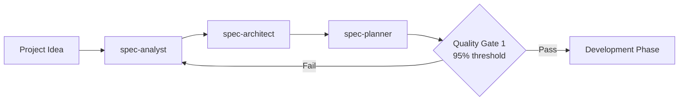
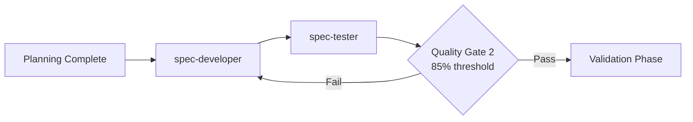
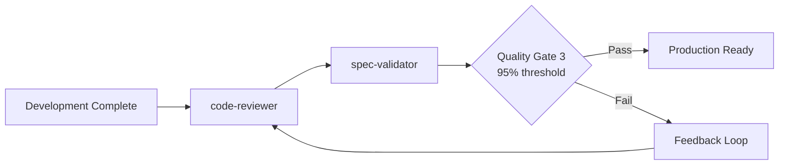
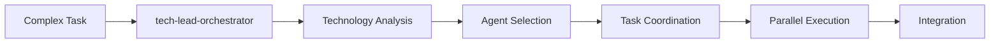
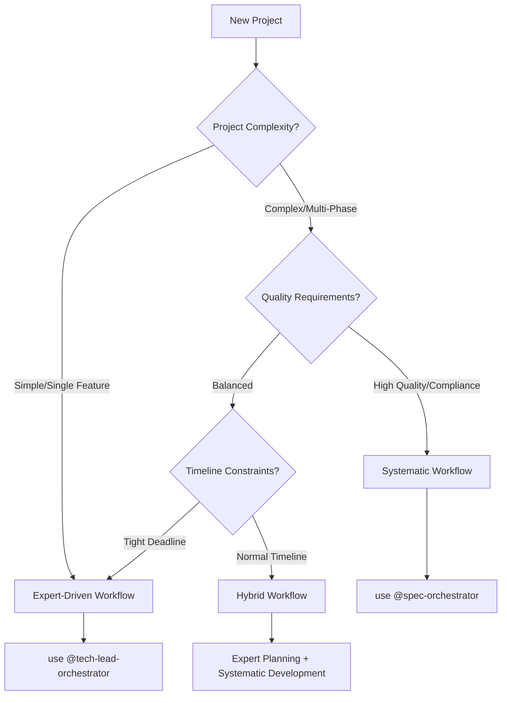

# ClaudeSwarm Workflows

Complete guide to development workflows and patterns using the ClaudeSwarm agent ecosystem.

## Overview

ClaudeSwarm supports multiple workflow approaches to match your development style and project requirements:

1. **[Systematic Workflow](#systematic-workflow)**: Quality-gated development with spec-orchestrator
2. **[Expert-Driven Workflow](#expert-driven-workflow)**: Dynamic coordination with tech-lead-orchestrator  
3. **[Hybrid Workflows](#hybrid-workflows)**: Combining both approaches
4. **[Specialised Patterns](#specialised-patterns)**: Domain-specific development patterns

## Systematic Workflow

The systematic workflow follows a three-phase approach with automated quality gates.

### When to Use Systematic Workflow

✅ **Best For**:
- New feature development
- Complete applications from scratch
- Quality-critical projects
- Teams requiring consistent processes
- Documentation-heavy projects

❌ **Not Ideal For**:
- Quick fixes or debugging
- Highly experimental prototypes  
- Tight deadline pressure
- Simple one-file changes

### Three-Phase Process

#### Phase 1: Planning & Analysis (20-25% of time)



**Agents**: spec-analyst → spec-architect → spec-planner

**Example Workflow**:
```bash
# Complete planning phase
claude "use @spec-orchestrator for planning phase: Create a social media application with user profiles, posts, comments, and real-time notifications"

# Agents execute in sequence:
# 1. spec-analyst: Creates requirements.md, user-stories.md
# 2. spec-architect: Creates architecture.md, api-spec.md  
# 3. spec-planner: Creates tasks.md, timeline estimates
# 4. Quality Gate 1: Validates completeness (>95%)
```

**Quality Gate 1 Criteria**:
- Requirements completeness and clarity
- Architecture technical feasibility
- Task breakdown granularity
- Risk assessment coverage
- Stakeholder alignment validation

#### Phase 2: Development & Implementation (60-65% of time)



**Agents**: spec-developer → spec-tester

**Example Workflow**:
```bash
# Continue to development phase
# spec-developer: Implements all tasks from planning phase
# spec-tester: Creates comprehensive test suites
# Quality Gate 2: Validates code quality (>85%)
```

**Quality Gate 2 Criteria**:
- Code quality standards adherence
- Test coverage achievement (>80%)
- Performance benchmark compliance
- Security vulnerability scan results
- Documentation completeness

#### Phase 3: Validation & Deployment (15-20% of time)



**Agents**: code-reviewer → spec-validator

**Example Workflow**:
```bash
# Final validation phase
# code-reviewer: Comprehensive code review with security focus
# spec-validator: Production readiness assessment
# Quality Gate 3: Final validation (>95%)
```

**Quality Gate 3 Criteria**:
- Code review completion and approval
- All tests passing (unit, integration, e2e)
- Security audit completion
- Documentation audit completion
- Deployment checklist verification

### Configurable Quality Thresholds

```bash
# Enterprise quality (maximum rigor)
claude "use @spec-orchestrator with quality threshold 95: Create payment processing system"

# Production quality (balanced)
claude "use @spec-orchestrator with quality threshold 85: Create blog platform"

# Prototype quality (rapid development)
claude "use @spec-orchestrator with quality threshold 75: Create landing page prototype"
```

### Phase-Specific Execution

```bash
# Planning only
claude "use @spec-orchestrator for planning phase only: Design architecture for microservices platform"

# Development only (when planning exists)
claude "use @spec-developer: Implement authentication module based on docs/requirements.md"

# Validation only (for existing code)
claude "use @spec-orchestrator for validation phase: Review and validate existing e-commerce codebase"
```

## Expert-Driven Workflow

The expert-driven workflow uses intelligent agent selection and coordination.

### When to Use Expert-Driven Workflow

✅ **Best For**:
- Complex multi-technology integrations
- Debugging and optimisation tasks
- Legacy system modifications
- Specialised domain requirements
- Time-critical deliverables

❌ **Not Ideal For**:
- Projects requiring extensive documentation
- Teams needing process standardization
- Quality audit requirements
- Regulatory compliance needs

### Coordination Process



**Example Workflow**:
```bash
claude "use @tech-lead-orchestrator: Build e-commerce platform with Django backend, React frontend, and Stripe payment integration"

# Tech-lead analysis and routing:
# 1. Detects Django + React + Payment requirements
# 2. Routes to: project-analyst → django-backend-expert → django-api-developer → react-nextjs-expert → code-reviewer
# 3. Coordinates parallel execution where possible
# 4. Manages sequential dependencies
```

### Agent Routing Example

**Tech-Lead Response Format**:
```markdown
## Task Analysis
- E-commerce platform with user accounts, product catalog, shopping cart
- Technology stack: Django + React + PostgreSQL + Stripe

## Agent Assignments  
Task 1: Analyze existing codebase structure → AGENT: @code-archaeologist
Task 2: Design user and product models → AGENT: @django-backend-expert
Task 3: Create API endpoints → AGENT: @django-api-developer  
Task 4: Build React components → AGENT: @react-component-architect
Task 5: Integrate Stripe payments → AGENT: @django-api-developer
Task 6: Performance review → AGENT: @performance-optimizer

## Execution Order
- **Sequential**: Task 1 → Task 2 → Task 3
- **Parallel**: Tasks 4, 5 after Task 3 (max 2)
- **Sequential**: Task 6 after Tasks 4, 5

## Available Agents for This Project
- code-archaeologist: Codebase analysis
- django-backend-expert: Core Django development
- django-api-developer: API and payment integration
- react-component-architect: Frontend components
- performance-optimizer: Performance optimisation
```

### Intelligent Agent Selection

The tech-lead-orchestrator follows these rules:

1. **Framework-Specific Preference**: django-backend-expert > backend-developer
2. **Technology Matching**: React task → react-component-architect
3. **Parallel Optimization**: Max 2 agents simultaneously
4. **Quality Assurance**: Always includes code-reviewer for production

## Hybrid Workflows

Combining systematic and expert-driven approaches for optimal results.

### Pattern 1: Expert Planning + Systematic Development

```bash
# Use experts for analysis and architecture
claude "use @tech-lead-orchestrator for analysis phase: Analyze requirements for inventory management system"

# Switch to systematic workflow for implementation
claude "use @spec-orchestrator starting from development phase: Implement the inventory system based on planning documents"
```

### Pattern 2: Systematic Foundation + Expert Optimization

```bash
# Complete systematic development
claude "use @spec-orchestrator with quality threshold 85: Create blog platform"

# Use experts for specialised optimisation
claude "use @performance-optimizer: Optimise database queries and add caching to the blog platform"
claude "use @code-reviewer: Security audit of authentication implementation"
```

### Pattern 3: Phase-Specific Expert Integration

```bash
# Systematic workflow with expert consultation
claude "use @spec-orchestrator: Create CRM system, but consult @senior-backend-architect during architecture phase for scalability recommendations"
```

## Specialised Patterns

Domain-specific workflow patterns for common development scenarios.

### Web Application Development

**Full-Stack Application**:
```bash
# Method 1: Systematic approach
claude "use @spec-orchestrator with quality threshold 90: Create task management web application with user accounts, project collaboration, and real-time updates"

# Method 2: Expert-driven approach  
claude "use @tech-lead-orchestrator: Build task management app with React frontend, Node.js backend, WebSocket real-time features, and MongoDB"
```

**API-First Development**:
```bash
# Systematic API development
claude "use @spec-orchestrator: Create REST API for inventory management with authentication, CRUD operations, and reporting endpoints"

# Expert API architecture
claude "use @api-architect: Design microservices API architecture for e-commerce with user service, product service, and order service"
```

### Mobile Development

**React Native Application**:
```bash
claude "use @tech-lead-orchestrator: Build React Native app with offline synchronization, push notifications, and biometric authentication"
```

**PWA Development**:
```bash
claude "use @spec-orchestrator: Create Progressive Web App for restaurant ordering with offline menu browsing and payment processing"
```

### Legacy System Integration

**Legacy Analysis and Documentation**:
```bash
# Phase 1: Analysis
claude "use @code-archaeologist: Analyze this inherited PHP e-commerce system and create comprehensive documentation"

# Phase 2: Modernization planning
claude "use @tech-lead-orchestrator: Plan migration of legacy PHP system to modern Laravel architecture"

# Phase 3: Implementation
claude "use @spec-orchestrator: Implement the Laravel migration based on analysis and planning documents"
```

### Performance Optimization

**Performance Audit Workflow**:
```bash
# Phase 1: Analysis
claude "use @performance-optimizer: Analyse performance bottlenecks in this Django application"

# Phase 2: Database optimisation
claude "use @django-orm-expert: Optimise database queries identified in performance analysis"

# Phase 3: Frontend optimisation
claude "use @react-component-architect: Optimise React component rendering based on performance findings"

# Phase 4: Validation
claude "use @spec-validator: Validate performance improvements and create benchmarking report"
```

### Security-First Development

**Security-Focused Workflow**:
```bash
# Systematic development with security emphasis
claude "use @spec-orchestrator with quality threshold 95: Create banking application with multi-factor authentication, encryption, and audit logging"

# Expert security review
claude "use @code-reviewer: Comprehensive security audit of authentication and authorization systems"
```

## Quality Gate Configuration

### Threshold Selection Guide

| Project Type | Recommended Threshold | Rationale |
|--------------|----------------------|-----------|
| Prototype/MVP | 75% | Fast iteration, basic quality |
| Internal Tools | 85% | Balanced quality and speed |
| Customer-Facing | 90% | High quality, good UX |
| Enterprise/Financial | 95% | Maximum quality, compliance |
| Open Source | 90% | Community standards, documentation |

### Custom Quality Criteria

```bash
# Custom security-focused criteria
claude "use @spec-orchestrator with quality threshold 95 and additional security validation: Create user authentication system"

# Custom performance-focused criteria  
claude "use @spec-orchestrator with quality threshold 90 and performance benchmarking: Create high-throughput API service"
```

### Failure Response Patterns

When quality gates fail:

1. **Iterative Improvement** (Automatic):
   ```bash
   # System automatically:
   # 1. Identifies specific failure points
   # 2. Provides targeted feedback
   # 3. Allows agent revision (max 3 iterations)
   # 4. Re-evaluates against same criteria
   ```

2. **Expert Intervention** (Manual):
   ```bash
   # Manual escalation for persistent failures
   claude "use @tech-lead-orchestrator: Quality gate failing on security criteria, need expert intervention"
   ```

3. **Threshold Adjustment** (Strategic):
   ```bash
   # Adjust expectations for specific constraints
   claude "use @spec-orchestrator with quality threshold 80: Complete project under tight deadline constraints"
   ```

## Advanced Workflow Patterns

### Microservices Development

```bash
# Service-by-service systematic approach
claude "use @spec-orchestrator: Create user service microservice with authentication, profile management, and admin features"
claude "use @spec-orchestrator: Create product service microservice with catalog, inventory, and search features"
claude "use @spec-orchestrator: Create order service microservice with cart, checkout, and payment processing"

# Integration and orchestration
claude "use @tech-lead-orchestrator: Integrate microservices with API gateway, service discovery, and monitoring"
```

### CI/CD Integration

```bash
# Development with CI/CD preparation
claude "use @spec-orchestrator with quality threshold 90: Create web application with automated testing, deployment scripts, and monitoring setup"

# CI/CD optimisation
claude "use @tech-lead-orchestrator: Optimize build pipeline, add automated security scanning, and implement blue-green deployment"
```

### Documentation-Driven Development

```bash
# Documentation-first approach
claude "use @documentation-specialist: Create comprehensive API documentation for planned e-commerce system"
claude "use @spec-orchestrator starting from architecture phase: Implement e-commerce system based on API documentation"
```

## Workflow Selection Decision Tree



## Best Practices

### Workflow Selection
1. **Start with orchestrators** - Never select individual agents for complex tasks
2. **Match workflow to project needs** - Consider complexity, quality, and timeline
3. **Use hybrid approaches** when appropriate - Combine strengths of both methods
4. **Trust the quality gates** - They ensure consistent standards

### Agent Coordination
1. **Follow routing exactly** - Don't substitute agents unless specified
2. **Allow iterative improvement** - Quality gates enable refinement
3. **Include quality assurance** - Always use code-reviewer for production
4. **Document decisions** - Create artifacts for future reference

### Quality Management
1. **Set realistic thresholds** - Match quality expectations to project needs
2. **Allow agent iteration** - Up to 3 rounds for quality improvement
3. **Escalate when needed** - Use human intervention for persistent issues
4. **Learn from failures** - Update processes based on experiences

This comprehensive workflow guide enables you to leverage ClaudeSwarm's full capabilities for any development scenario.